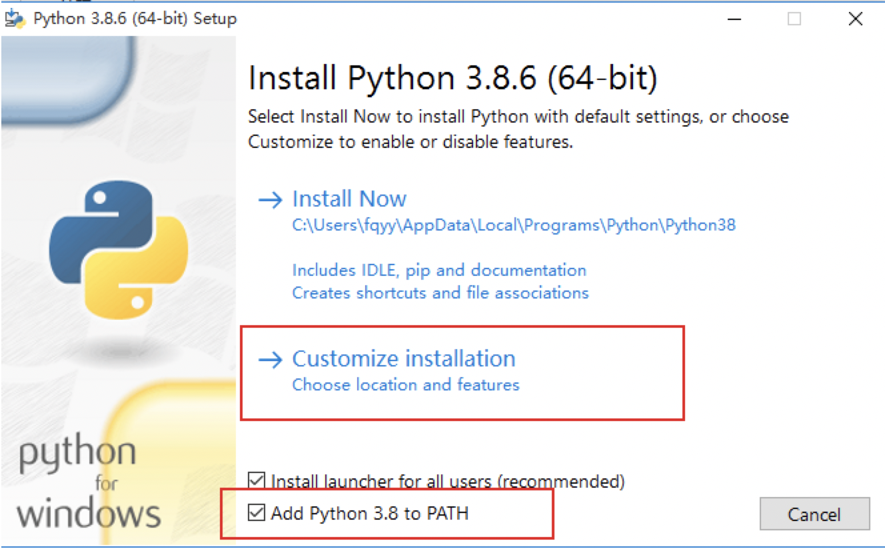
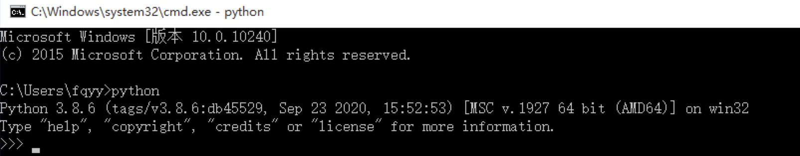
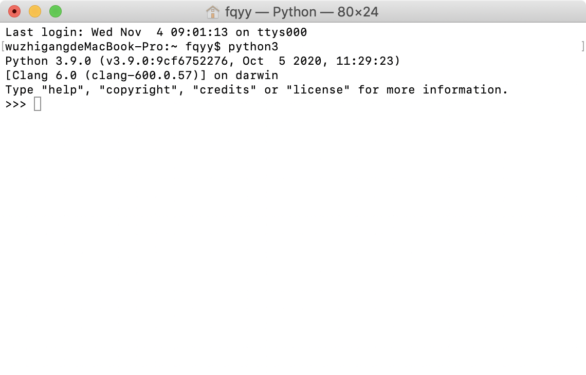
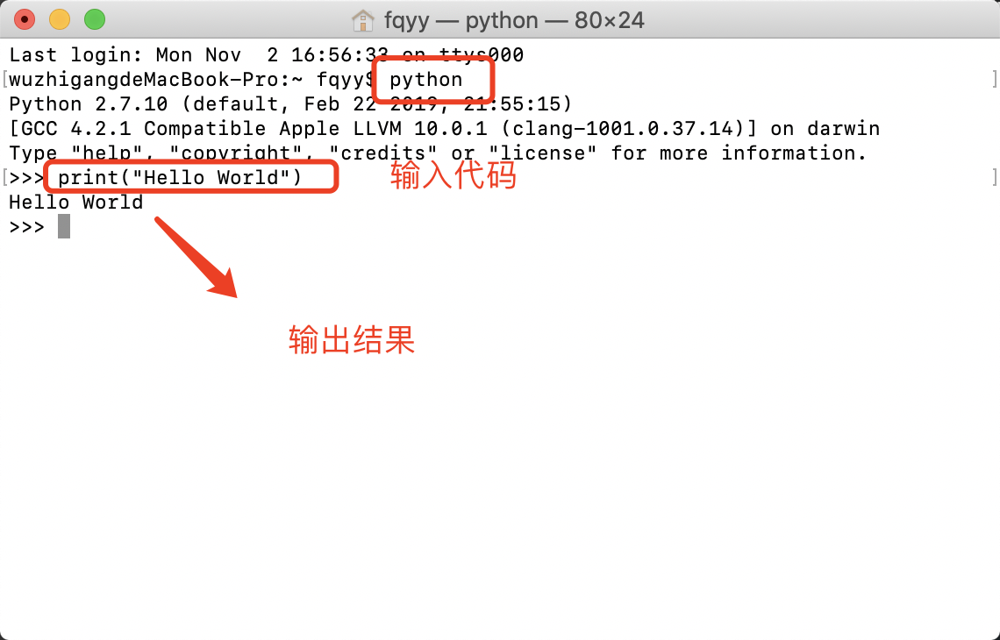
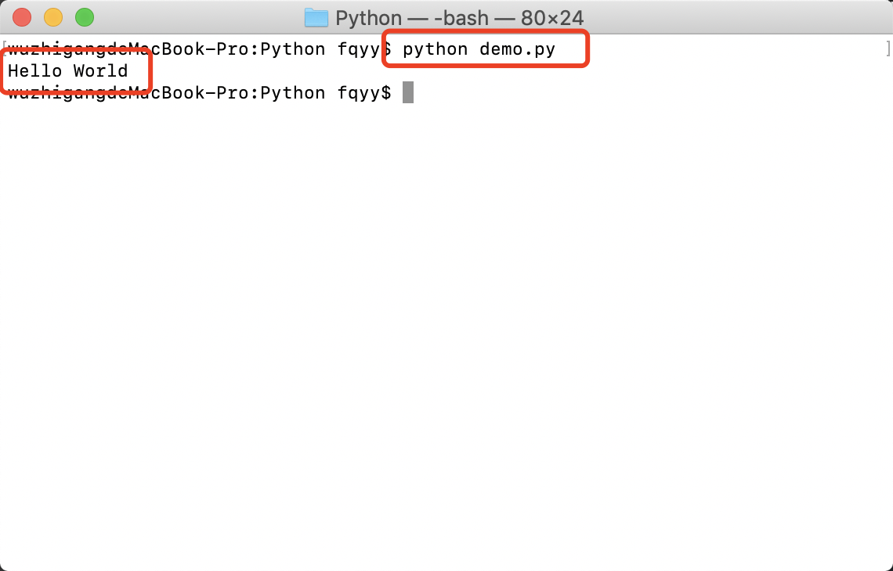

[toc]

# 编程语言分类
## 机器语言

&emsp;&emsp;机器语言是使用计算机能理解的语言进行编程的，计算机能直接理解的是二进制指令（<font color=red> *__用二进制代码 0 和 1 描述的指令称为机器指令__* </font>），所以机器语言是直接用二进制编程并且是直接操作硬件的，它的主要特点如下：

+ <font color=orchid>*__执行效率最高：__*</font> 编写的程序可以被计算机无障碍理解、直接运行
+ <font color=orchid>*__开发效率最低：__*</font> 用机器语言编写程序时编程人员需要熟记计算机的全部指令代码以及代码的含义；在编写程序时，程序员得自己处理每条指令和每一数据的存储分配和输入输出，还得记住编程过程中每步所使用的工作单元处在何种状态；而且编出的程序全是 0 和 1 的指令代码，直观性差、不便阅读和书写，还容易出错
+ <font color=orchid>*__跨平台性差：__*</font> 依赖具体的硬件，跨平台性差

## 汇编语言

&emsp;&emsp;汇编语言的实质和机器语言是相同的，都是直接对硬件操作，只不过汇编语言采用了英文缩写的标识符，更容易识别和记忆。它的特点总结如下：

+ <font color=orchid>*__执行效率高，但较之机器语言稍低：__*</font> 源程序经汇编生成的可执行文件不仅比较小，而且执行速度很快
+ <font color=orchid>*__开发效率低：__*</font> 需要编程者将每一步具体的操作用命令的形式写出来，因此汇编源程序一般比较冗长、复杂、容易出错，而且使用汇编语言编程需要有更多的计算机专业知识。比起机器语言来说复杂度稍低，但是还是比较复杂
+ <font color=orchid>*__跨平台性差：__*</font> 同样依赖具体的硬件

## 高级语言

&emsp;&emsp;高级语言是用人类的字符去编写程序，而人类的字符是在向操作系统发送指令，并不是直接操作硬件，所以高级语言是与操作系统打交道的。此处的高级指的是开发者无需考虑硬件细节，因而开发效率可以得到极大的提升。但正因为高级语言离硬件较远，计算机需要通过翻译才能理解，所以执行效率会低于低级语言。按照翻译的方式的不同，高级语言又分为两种： <font color=red>*__编译型语言和解释型语言__*</font> 。

### 编译型语言

&emsp;&emsp;编译型语言是把程序所有代码编译成计算机能识别的二进制指令，之后操作系统会拿着编译好的二进制指令直接操作硬件。它的特点如下：

+ <font color=orchid>*__执行效率高：__*</font> 编译是指在源程序执行之前就将程序源代码"翻译"成目标代码（即机器语言），因此其目标程序可以脱离其语言环境独立执行，执行效率较高
+ <font color=orchid>*__开发效率低：__*</font> 应用程序一旦需要修改，必须先修改源代码，然后重新编译、生成新的目标文件才能执行，所以开发效率低于解释型
+ <font color=orchid>*__跨平台性差：__*</font> 编译型代码是针对某一个平台翻译的，当前平台翻译的结果无法拿到不同的平台使用，针对不同的平台必须重新编译

### 解释型语言

&emsp;&emsp;解释型语言需要有一个解释器， <font color=red>*__解释器会读取程序代码，一边翻译一边执行__* </font>。它的特点如下：

+ <font color=orchid>*__执行效率低：__*</font> 解释型语言的实现中，翻译器并不产生目标机器代码，而是产生易于执行的中间代码。这种中间代码与机器代码是不同的，中间代码的解释是由软件支持的，不能直接使用硬件，软件解释器通常会导致执行效率较低
+ <font color=orchid>*__开发效率高：__*</font> 用解释型语言编写的程序是由另一个可以理解中间代码的解释程序执行的，与编译程序不同的是解释程序的任务是逐一将源程序的语句解释成可执行的机器指令，不需要将源程序翻译成目标代码再执行。解释程序的优点是当语句出现语法错误时，可以立即引起程序员的注意，而程序员在程序开发期间就能进行校正。
+ <font color=orchid>*__跨平台性强：__*</font> 代码运行是依赖于解释器，不同平台有对应版本的解释器，所以解释型的跨平台性强

> <font color=orange>*__混合型语言：__*</font> Java是一类特殊的编程语言，Java程序也需要编译，但是却没有直接编译为机器语言，而是编译为字节码，然后在Java虚拟机上以解释方式执行字节码。

# Python语言介绍

&emsp;&emsp;Python的创始人是吉多·范罗苏姆，Python可以应用于众多领域，如：人工智能、数据分析、爬虫、金融量化、云计算、WEB开发、自动化运维/测试、游戏开发、网络服务、图像处理等众多领域。

## Python解释器
### Python解释器介绍

&emsp;&emsp;官方的Python解释器是基于C语言开发的一个软件，该软件的功能就是读取以.py结尾的文件内容，然后按照定义好的语法和规则去翻译并执行相应的代码。这种用C实现的解释器称为CPython，它是Python领域性能最好、应用最广泛的一款解释器。但其实解释器作为一款应用软件，完全可以采用其他语言来开发，只要能解释Python这门语言的语法即可。主流的Python解释器如下：

+ <font color=orchid>*__Jython：__*</font>  JPython解释器是用JAVA编写的Python解释器，可以直接把Python代码编译成Java字节码并执行
+ <font color=orchid>*__IPython：__*</font> IPython是基于CPython之上的一个交互式解释器，也就是说IPython只是在交互方式上有所增强，但是执行Python代码的功能和CPython是完全一样的
+ <font color=orchid>*__PyPy：__*</font> PyPy是用Python语言实现的Python解释器，PyPy提供了JIT编译器和沙盒功能，对Python代码进行动态编译（注意不是解释），因此运行速度比CPython还要快
+ <font color=orchid>*__IronPython：__*</font> IronPython是运行在微软.Net平台上的Python解释器，可以直接把Python代码编译成.Net的字节码

### 安装Python解释器

&emsp;&emsp;Python解释器目前已支持所有主流操作系统，在Linux、Unix、Mac系统上自带Python解释器，在Windows系统上需要安装一下。

<font color="skyblue" size="3px">1. Windows</font>

&emsp;&emsp;首先下载Windows版本的Python解释器，然后运行安装：



&emsp;&emsp;然后直接下一步直到安装成功，然后打开任务终端，输入下面的代码检测是否安装成功：



> <font color=orange>*__注意：__*</font> 如果执行 <font color="red">*__python__*</font> 命令的时候出现了类似 <font color=red>**python不是可识别的内部或者外部命令**</font> 的错误，很可能是因为执行安装程序的时候没有选中 <font color=red>**Add Python to Path**</font> 的复选框。此时只需要 <font color=red>**将文件 python.exe 的路径配置到 path 环境变量中**</font> 就可以了。

<font color="skyblue" size="3px">2. Mac</font>

&emsp;&emsp;大多数MacOS系统都默认安装了Python，如果需要安装最新的Python3版本，首先去官网下载Python解释器的Mac版本并运行安装，然后通过下面的方法判断是否安装成功：



<font color="skyblue" size="3px">3. Linux</font>

&emsp;&emsp;大多数Linux系统默认安装了Python，如果需要安装其它版本的Python，可以使用名为 <font color=red>*__deadsnakes__*</font> 的包，它能让你轻松地安装多个Python版本，请执行下面的命令：

```shell
sudo add-apt-repository ppa:deadsnakes/ppa 
sudo apt-get update 
sudo apt install python3.8
```

## 第一个Python程序
### 运行Python的两种方式

<font color="skyblue" size="3px">1. 交互式模式</font>

&emsp;&emsp;Python自带一个在终端窗口中运行的解释器，打开一个命令窗口，并在其中执行命令： <font color=red>*__python__*</font> ，如果出现了Python提示符（<<<）就说明系统已经找到了Python。然后在Python会话中直接执行输入代码就可以看到代码执行的结果：



&emsp;&emsp;如果要关闭该终端会话，可按 <font color=red>*__ctrl + z__*</font> ，也可以执行 <font color=red>*__exit()__*</font> 命令关闭。

<font color="skyblue" size="3px">2. 脚本文件</font>

&emsp;&emsp;创建一个 <font color=red> *__demo .py__* </font> 文件并输入下面的代码：

```python
print("Hello World")
```

&emsp;&emsp;然后在任务终端中输入下面的命令来执行该文件就可以看到代码运行的结果：



> <font color=orange>*__注意：__*</font> Python解释器执行程序是解释执行，解释的根本就是打开文件读内容，因此文件的后缀名并没有硬性限制，但通常定义为.py结尾。

### Python注释

&emsp;&emsp;注释就是就是对代码的解释说明，注释的内容不会被当作代码运行，通过注释可以增强代码的可读性。注释可以分为单行注释和多行注释：

+ <font color=orchid>*__单行注释：__*</font> 使用 **#（井号）**
+ <font color=orchid>*__多行注释：__*</font> 使用 **三对双引号** 或者 **三对单引号**

```python
""" 
这里是多行注释文本 
下面是一段输出内容的代码 
""" 

print("Hello World") # 单行注释，用来输出 Hello Wold 

''' 
使用单引号 
多行注释 
'''
```