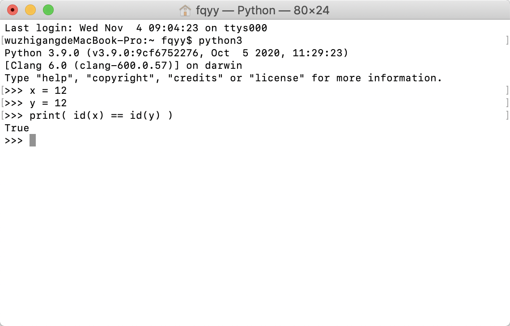
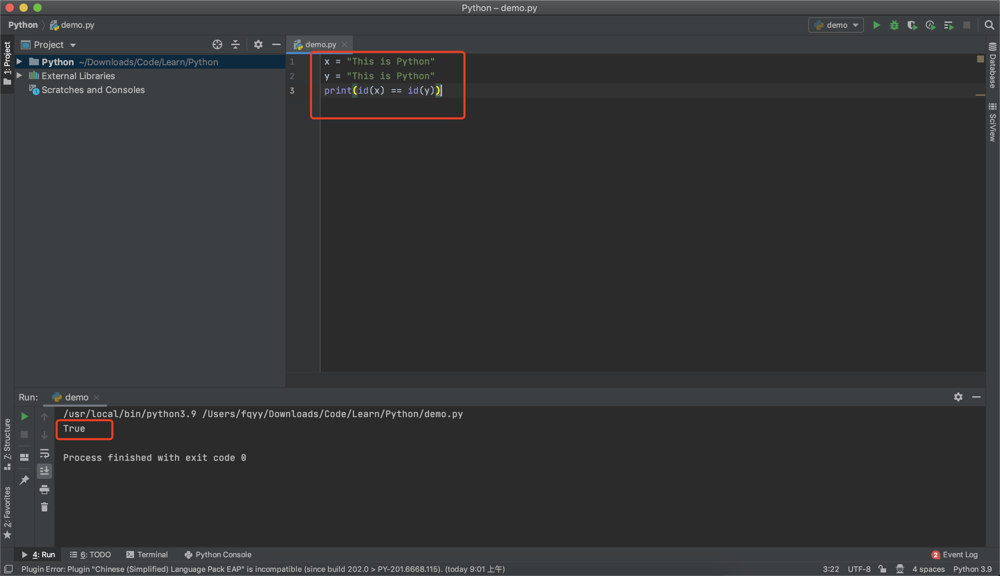

[toc]

# 变量

&emsp;&emsp;变量就是可以变化的量，程序执行的本质就是一系列状态的变化，所以我们需要有一种机制能够反映或者说是保存程序执行时状态以及状态的变化。

&emsp;&emsp;在学习变量之前，首先需要明确Python是<font color=red> *__解释型的强类型动态语言__* </font>：

+ <font color=orchid>*__解释型语言：__*</font> 代码运行是依赖于Python解释器
+ <font color=orchid>*__强类型语言：__*</font> 变量的数据类型一旦被定义就不会再改变（除非进行强转）。
+ <font color=orchid>*__动态型语言：__*</font> 运行时才进行数据类型检查，即在变量赋值时才确定变量的数据类型，不用事先给变量指定数据类型

## 变量的定义和使用

&emsp;&emsp;变量的定义由三部分组成：<font color=red> *__变量名 = 值__*</font>
 
+ <font color=orchid>*__变量名：__*</font> 指向值所在的内存地址，是访问到值的唯一方法
+ <font color=orchid>*__= ：__*</font> 赋值符号，用来将变量值的内存地址绑定到变量名
+ <font color=orchid>*__值：__*</font> 存储的数据

&emsp;&emsp;解释器执行到变量定义的代码时会申请内存空间存放变量值，然后将变量值的内存地址绑定给变量名，通过变量名即可引用到对应的值： 

```python
name = '张三' 	     # 定义一个存储姓名的变量
print(name) 		# 输出变量名对应的值：张三
```

## 变量的命名

&emsp;&emsp;变量名的命名应该<font color=red> *__见名知意__* </font>，并且需要遵循下面的命名规范： 

+ 变量名只能是字母、数字或下划线的任意组合
+ 变量名的第一个字符不能是数字
+ 不能使用Python关键字，如：’and'， ‘as’，'assert'等

> <font color=orange>*__注意：__*</font>
> 1. 虽然可以以中文命名，但是不推荐这么做
> 2. Python关键字：False、await、else、import、pass、None、break、except、in、raise、True、class、finally、is、return、and、continue、for、lambda、try、as、def、from、nonlocal、while、assert、del、global、not、with、async、elif、if、or、yield

&emsp;&emsp;Python有两种变量命名的风格： 

+ <font color=orchid>*__驼峰体：__*</font> *__CardNumber = 100__* 
+ <font color=orchid>*__纯小写加下划线（推荐使用该风格）：__*</font> *__card_number = 100__*  

## 变量的三大特性

&emsp;&emsp;变量的值具备三大特性： 

+ <font color=orchid>*__id：__*</font> 反应的是变量在内存中的唯一编号，内存地址不同id肯定不同
+ <font color=orchid>*__type：__*</font> 变量值的类型
+ <font color=orchid>*__value：__*</font> 变量的值
        
&emsp;查看变量值三大特性的方式如下：

```python
# 定义一个变量
number = 123  

# 获取id值
print( id( number ) )  		 # 140726649230816

# 获取类型
print( type( number ) ) 	# <class 'int'>

# 获取变量的值
print( number )   			  # 123
```

&emsp;&emsp;Python提供了 <font color=red>**is**</font> 和 <font color=red>**==**</font> 运算符：
 
+ <font color=orchid>*__is：__*</font> 比较两个变量值的id是否相等
+ <font color=orchid>*__==：__*</font> 比较两个变量的值是否相等

```python
# 定义两个字符串
x = 'This is String'
y = 'This is String'
z = x
print( id(x) == id(y) )  # false
print( x == y )          # true
print( id(x) == id(z) )  # true
```

> <font color=orange>*__在使用id的进行判断的时候有两个需要注意的地方：__*</font>
> 
> <font color=orachid>1. **小整数池**</font>
> 
> &emsp;&emsp;从Python解释器启动开始，就会在内存中事先申请好一系列内存并且存放好常用的整数（-5~256），所以对于这些数字不会再重复申请内存地址，使用id返回的值永远都是相同的：
> 
> 
> <font color=orachid>2. **PyCharm中的问题**</font>
> 
> &emsp;&emsp;PyCharm会对内存管理进行优化，所以得到的结果会有不同：
> 
> 

# 常量

&emsp;&emsp;在程序运行过程中，有些值是固定的，比如：圆周率（3.141592653），这些程序运行过程中不会改变的量就是常量。但<font color=red> *__在Python中没有一个专门的语法来定义常量，约定俗成是用全部大写的变量名表示常量__* </font>，如： 

```python
# 约定俗成的常量，实际上还是可以更改的
MESSAGE_LOGIN = 1001
```